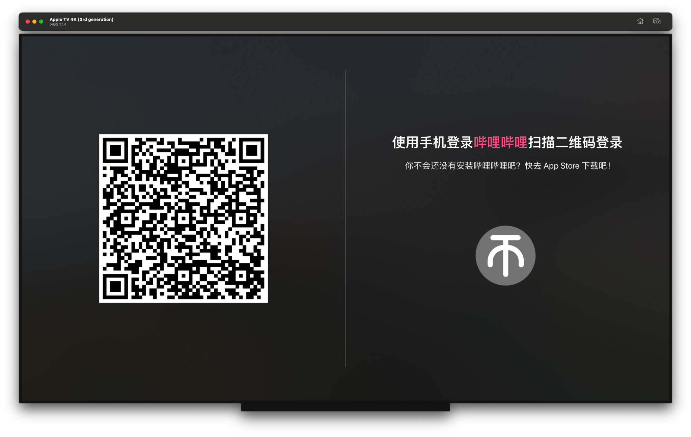
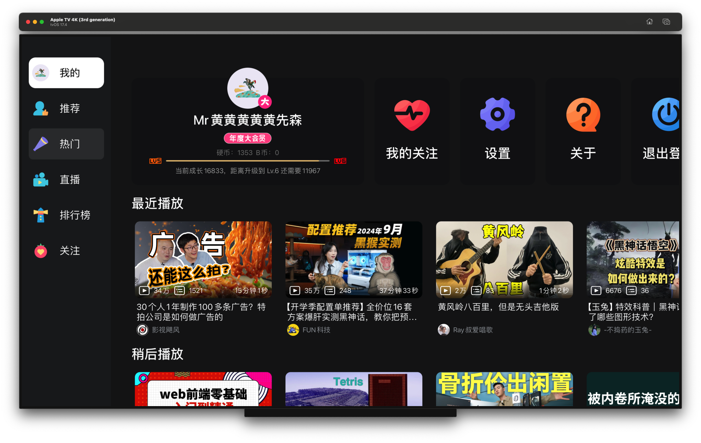
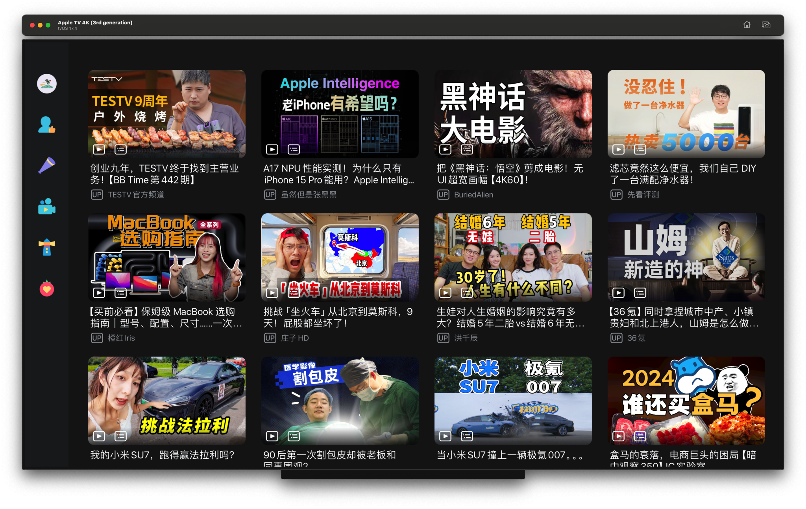
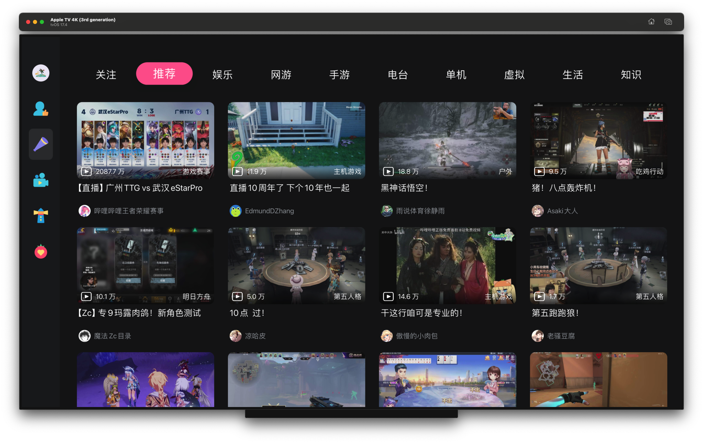
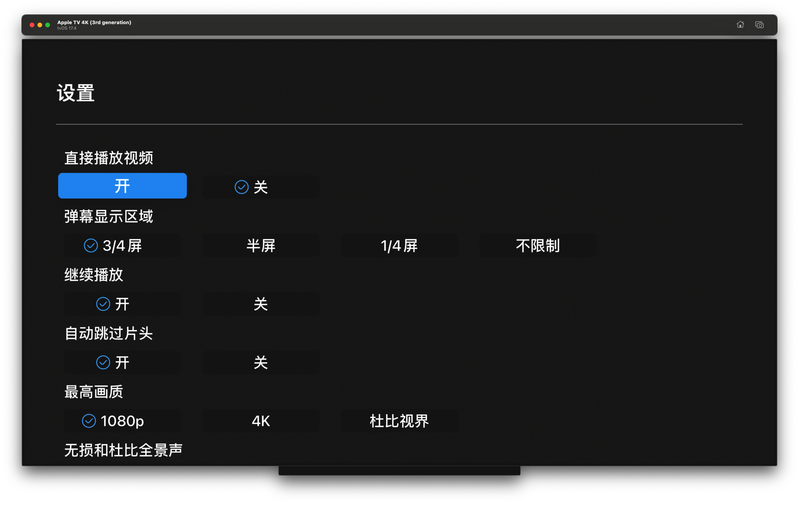
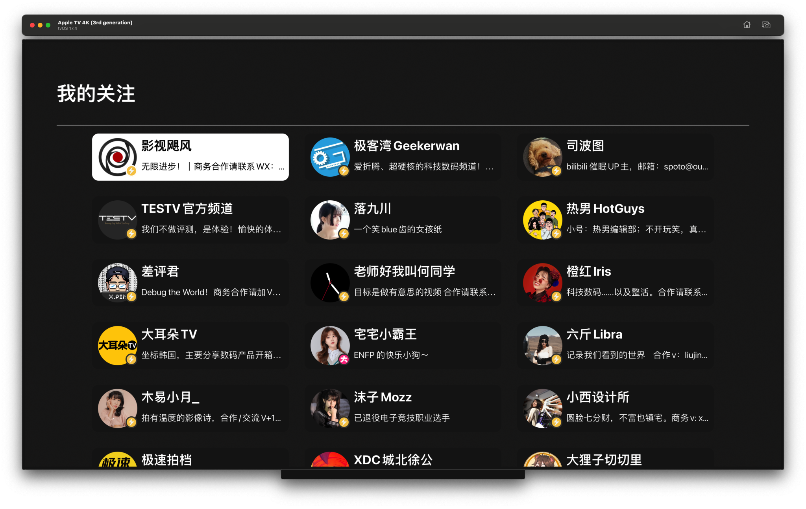

## bilibili for Apple TV

 
 
  

本项目基于 UIKit 使用 Swift 开发。对应 Android TV 版本 [bilibili for Android TV](https://github.com/zackaryhuang/bilitv_android)。感谢 [哔哩哔哩-API收集整理 ](https://github.com/SocialSisterYi/bilibili-API-collect)项目提供接口信息。

### APP 预览图

 
 
 
 
 
 
 
 

### 声明

请勿滥用，本项目仅用于学习和测试！相关内容如有侵权，可联系删除！